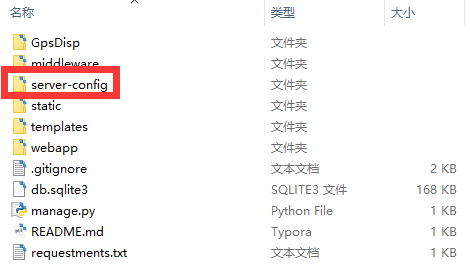

# Django-deploy

快速部署 Django 网站到 Linux 服务器

采用高性能模式: Django + Linux + Nginx + Supervisor + Gunicorn

- 基于 JSON 配置网站相关信息
- 自动生成 nginx, supervisor, gunicorn 配置文件
- 一键部署，一键更新，一键修复

## 一键部署

### 配置文件参数说明

| 参数                | 解释                                                         |
| :------------------ | ------------------------------------------------------------ |
| git-url             | 托管项目的网址，推荐使用 **https** 网址                      |
| web-name            | 网站名称，与注册在项目 `settings.py`中 `INSTALLED_APPS`名称相同 |
| nginx-port          | 服务器对外开放端口，并且保证云服务实例安全策略打开相应端口   |
| nginx-server_name   | 网站域名，默认 `localhost`                                   |
| gunicorn-port       | gunicorn 本地服务器监听端口,默认`8080`                       |
| gunicorn-work-class | gunicorn 工作模式: `sysc` 或者 `gevent`,默认 `gevent`        |
| test-page           | 网站首页，用于测试部署结果， 默认 `/`                        |
| get-server-ip       | Linux 下获取本机外网 IP 的网址，默认 `http://ident.me/`      |
| python-mirror       | python 镜像网站, 默认 `https://pypi.tuna.tsinghua.edu.cn/simple/` |

### 快速开始

1. 修改 `deploy.config.json`配置文件
2. 运行 `gen-config.py`
3. 复制 `server-config`文件夹到项目根目录 (与 manage.py 同级)
4. 连接服务器，执行 `deploy.sh` 内容

### 效果图

- 待部署网站结构图：
  

- 连接服务器，执行 `deploy.sh `语句

  

- 稍等片刻，部署成功

  

## 一键更新

自动备份代码，重启服务

1. 本机修改代码后更新到代码托管平台
2. 连接服务器，执行更新脚本 `/home/update_web_shs/update_<web-name>.sh`

更新成功：

## 一键修复

自动逐项检测，逐项修复

- 执行脚本: `bash /home/<web-name>/server-config/autofix.sh`

修复成功：

使用场景：

> 执行一键部署和一键更新脚本后，最终在  `==== OPEN TEST PAGE ====` 阶段，没有输出 `200 OK`。那么调用一键修复脚本

若一键修复后仍无法成功，参见帮助

## 项目约定目录说明

| 目录                              | 解释                                       |
| --------------------------------- | ------------------------------------------ |
| /home/\<web-name\>/               | 存放网站项目                               |
| /home/\<web-name\>/server-config/ | 存放服务器配置文件以及部署、更新、修复脚本 |
| /home/update_web_shs/             | 存放网站更新脚本                           |
| /home/backup/                     | 存放网站数据库备份，代码备份               |
| /home/.pyenvs/<web-name\>/        | 存放项目虚拟环境                           |
| /home/$USER/.pip/                 | 存放 python镜像配置文件                    |
| /var/log/<web-name\>/             | 存放项目 nginx, gunicorn 日志              |
| /var/log/supervisor/              | 存放 supervisor 日志                       |
| /etc/nginx/conf.d/                | 存放项目 nginx 配置文件                    |
| /etc/supervisor/conf.d/           | 存放项目 supervisor 配置文件               |

## 注意事项

- 保证云服务器安全策略中入站规则包含 `<nginx-port>`
- 保证 `gunicorn` 添加到项目 `settings.py` 的 `INSTALLED_APPS` 中
- 保证项目 `requestments.txt`为最新内容
- 更改静态资源以及初次部署，运行 `python manage.py collectstatic`

## 帮助

- 部署过程遇到错误 参考 `help/deploy-questions.md`
- Linux 相关操作 参考 'help/linux.md'

##TODO

- [ ] 建立虚拟环境默认系统版本，与项目python版本号不一致

